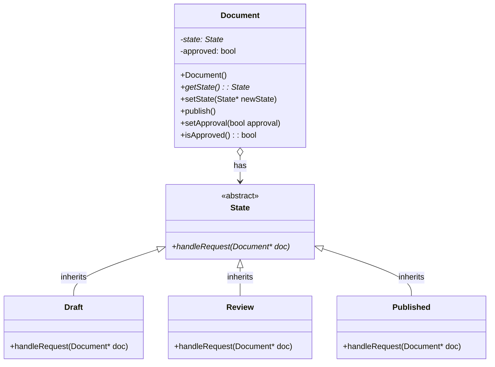

```mermaid
classDiagram
    class State {
        <<abstract>>
        +handleRequest(Document* doc)*
    }
    
    class Draft {
        +handleRequest(Document* doc)
    }
    
    class Review {
        +handleRequest(Document* doc)
    }
    
    class Published {
        +handleRequest(Document* doc)
    }
    
    class Document {
        -state: State*
        -approved: bool
        +Document()
        +getState(): State*
        +setState(State* newState)
        +publish()
        +setApproval(bool approval)
        +isApproved(): bool
    }

    State <|-- Draft : inherits
    State <|-- Review : inherits
    State <|-- Published : inherits
    Document o--> State : has
```
