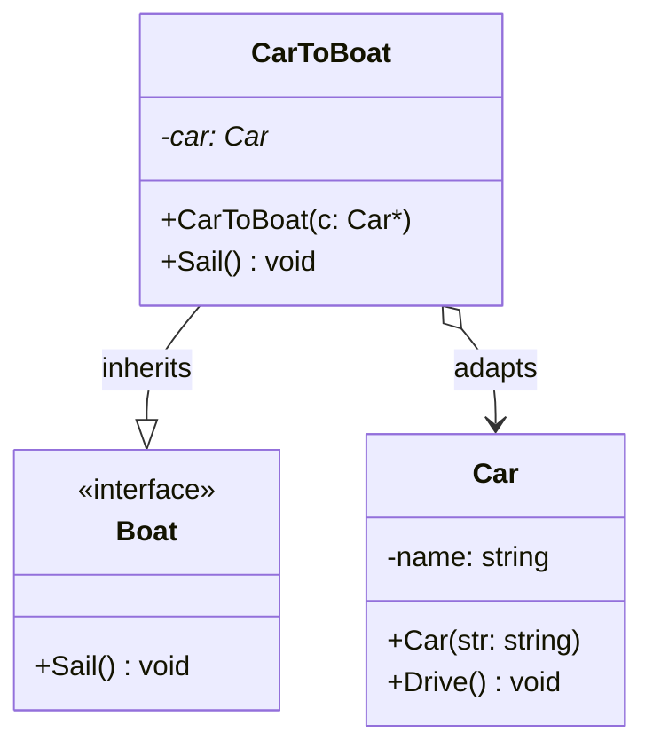

```mermaid
classDiagram
    class Boat {
        <<interface>>
        +Sail() void
    }
    
    class Car {
        -name: string
        +Car(str: string)
        +Drive() void
    }
    
    class CarToBoat {
        -car: Car*
        +CarToBoat(c: Car*)
        +Sail() void
    }

    CarToBoat --|> Boat : inherits
    CarToBoat o--> Car : adapts
```
